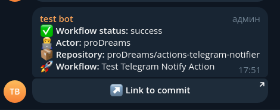

# Napkin Tools: Telegram Notify Action


[](https://t.me/press_any_button)
[](https://t.me/writeanynotes)

GitHub Action для отправки уведомлений в Telegram о статусе выполнения вашего рабочего процесса на GitHub. Это поможет
вам отслеживать процессы и получать обновления о успешных или неудачных выполнениях в реальном времени.

## Особенности

- Отправка обновлений о статусе в Telegram (например: успех, ошибка, отменено).
- Настройка уведомлений с кастомизированным заголовком, сообщением и подписью (footer).
- Включение дополнительных полей в оповещение, таких как автор коммита, репозиторий и имя рабочего процесса.
- Автоматическое создание кнопки с ссылкой на коммит в уведомлении, что облегчает отслеживание изменений прямо из
  Telegram.

## Требования

Необходимо:

- Токен бота Telegram (его можно создать с помощью [BotFather](https://t.me/BotFather)).
- Идентификатор чата для отправки сообщений.

## Входные параметры

| Название        | Обязательный | Описание                                                                                                                                                |
|-----------------|--------------|---------------------------------------------------------------------------------------------------------------------------------------------------------|
| `token`         | Да           | Токен бота Telegram. Используйте GitHub Secrets для безопасного хранения.                                                                               |
| `chat_id`       | Да           | Идентификатор чата, куда будет отправлено сообщение. Используйте GitHub Secrets для безопасного хранения.                                               |
| `thread_id`     | Нет          | Идентификатор темы для супергрупп. Необязательно.                                                                                                       |
| `status`        | Да           | Статус рабочего процесса (например, `success`, `failure`, `cancelled`, `info`). Получаем из `${{ job.status }}`, либо передаем сами, например `pending` |
| `title`         | Нет          | Текст заголовка для сообщения. По умолчанию используется общее сообщение о статусе, если не указано другое.                                             |
| `message`       | Нет          | Пользовательский текст сообщения для включения в уведомление.                                                                                           |
| `footer`        | Нет          | Текст для добавления в конец уведомления.                                                                                                               |
| `notify_fields` | Нет          | Список дополнительных полей, разделенных запятыми, которые будут включены: `actor`, `repository`, `workflow`, `branch`, `commit`, `repo_with_tag`.      |

### Значения `notify_fields`

| Поле            | Описание                                              |
|-----------------|-------------------------------------------------------|
| `actor`         | Имя пользователя, запустившего workflow.              |
| `repository`    | Название репозитория, в котором выполняется workflow. |
| `workflow`      | Название workflow, запущенного в GitHub Actions.      |
| `branch`        | Ветка, в которой запущен workflow.                    |
| `commit`        | Первая строка сообщения коммита                       |
| `repo_with_tag` | Название репозитория с тегом.                         |

## Пример использования

Вот пример того, как использовать этот action в вашем рабочем процессе на GitHub:

```yaml
name: CI
on:
  push:
    branches:
      - main

jobs:
  notify:
    runs-on: ubuntu-latest
    steps:
      - name: Запуск действия уведомления в Telegram
        uses: proDreams/actions-telegram-notifier@main
        if: always()
        with:
          token: ${{ secrets.TELEGRAM_BOT_TOKEN }}
          chat_id: ${{ secrets.TELEGRAM_CHAT_ID }}
          status: ${{ job.status }}
          notify_fields: "actor,repository,workflow"
```

### Расширенное использование

Вы можете настроить уведомление, включив дополнительные параметры, такие как `message` и `footer`:

```yaml
- name: Запуск действия уведомления в Telegram
  uses: proDreams/actions-telegram-notifier@main
  if: always()
  with:
    token: ${{ secrets.TELEGRAM_BOT_TOKEN }}
    chat_id: ${{ secrets.TELEGRAM_CHAT_ID }}
    status: ${{ job.status }}
    notify_fields: "actor,repository,workflow"
    message: "Текст сообщения"
    footer: "Текст подписи"
```

## Примеры уведомлений

### Уведомление об успешном завершении



## Обработка ошибок

- Если запрос к API Telegram не удастся, действие зарегистрирует сообщение об ошибке, и рабочий процесс завершится с
  ошибкой.
- Частые проблемы включают неверный `token` или `chat_id`.

## Детали разработки

- **Версия Rust:** Для работы действия используется Rust 1.83, указанный в Dockerfile.
- **Совместимость с версиями GitHub Actions:** Совместимо с любыми современными версиями GitHub Actions.
- **Dockerfile:** Действие контейнеризовано, что гарантирует его стабильную работу в любой среде.

## Автор

- Иван "proDream" Ашихмин

## Участники

<a href="https://github.com/proDreams/actions-telegram-notifier/graphs/contributors">
  
</a>

