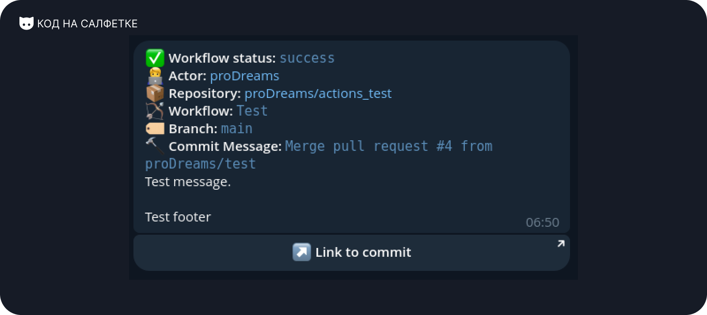
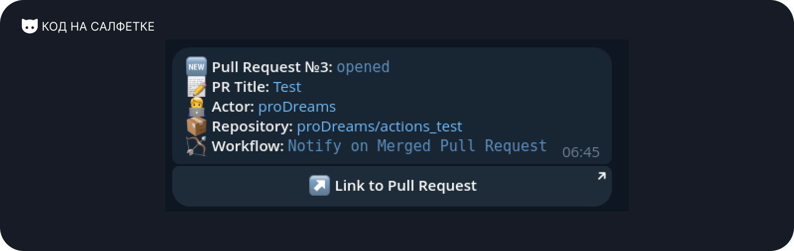
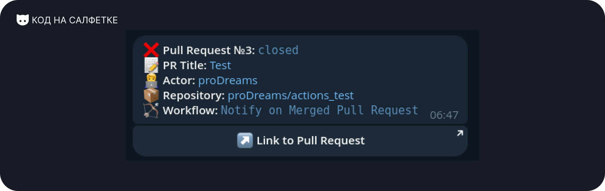
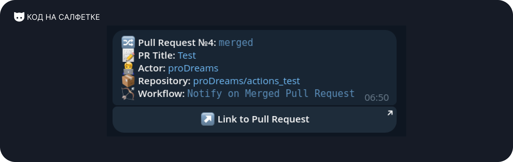

# Napkin Tools: Actions Telegram Notify


[](https://t.me/press_any_button)
[](https://t.me/writeanynotes)

Action для отправки уведомлений в Telegram о статусе выполнения Workflow на GitHub/Gitea/Github Actions совместимой
CI/CD-системе.

Actions Telegram Notify помогает отслеживать статус выполняемых Workflow.

## Оглавление

- [Особенности](#особенности)
- [Требования](#требования)
- [Аргументы запуска](#аргументы-запуска)
    - [Значения `status`](#значения-status)
    - [Значения `notify_fields`](#значения-notify_fields)
- [Пример использования](#пример-использования)
    - [Событие `Push`](#событие-push)
        - [Разбор полей](#разбор-полей)
    - [Событие `Pull Request`](#событие-pull-request)
- [Примеры уведомлений](#примеры-уведомлений)
    - [Уведомление об успешном завершении Workflow в Push-событии](#уведомление-об-успешном-завершении-workflow-в-push-событии)
    - [Уведомлении об открытии Pull Request](#уведомлении-об-открытии-pull-request)
    - [Уведомлении о закрытии Pull Request](#уведомлении-о-закрытии-pull-request)
    - [Уведомлении о слиянии Pull Request](#уведомлении-о-слиянии-pull-request)
- [Автор](#автор)
- [Поддержка](#поддержка)
- [Участники](#участники)
- [Лицензия](#лицензия)

## Особенности

- Отправка обновлений о статусе в Telegram (например: успех, ошибка, отменено).
- Настройка уведомлений с кастомизированным заголовком (title), сообщением (message) и подписью (footer).
- Включение дополнительных полей в оповещение, таких как автор коммита, репозиторий, название Workflow и другие.
- Обработка событий Push и Pull Request. (Нужно больше? Напишите в Issue или отправьте Pull Request!)
- Автоматическое создание кнопки со ссылкой на Commit или Pull Request в уведомлении.

## Требования

Для работы Actions Telegram Notify требуется:

- **Telegram Bot Token** (его можно создать с помощью [BotFather](https://t.me/BotFather)).
- **Telegram Chat ID**:
    - Для личных сообщений от бота: `1234567`.
    - Для небольшой группы: `-1234567`
    - Для большой группы/супергруппы: `-1001234567`
    - **Важно:**
        - Для личных сообщений необходимо начать диалог с ботом.
        - Для групп необходимо добавить бота в группу и дать ему минимальные права администратора, чтобы он смог
          отправлять сообщения.
- **(Необязательно) Telegram Chat Thread ID**. Необходим для отправки сообщений в определённую тему в супергруппе.

## Аргументы запуска

| Название        | Обязательный | Описание                                                                                                                                   |
|-----------------|--------------|--------------------------------------------------------------------------------------------------------------------------------------------|
| `token`         | Да           | Telegram Bot Token. Используйте GitHub Secrets для безопасного хранения.                                                                   |
| `chat_id`       | Да           | Telegram Chat ID. Используйте GitHub Secrets для безопасного хранения.                                                                     |
| `thread_id`     | Нет          | Telegram Chat Thread ID.                                                                                                                   |
| `status`        | Нет          | Статус рабочего процесса, получаем из `${{ job.status }}`, либо передаем сами, например `pending`. По умолчанию `info`, если не указан.    |
| `title`         | Нет          | Текст заголовка для сообщения. По умолчанию используется общее сообщение.                                                                  |
| `message`       | Нет          | Пользовательский текст сообщения для включения в уведомление.                                                                              |
| `footer`        | Нет          | Текст для добавления в конец уведомления.                                                                                                  |
| `notify_fields` | Нет          | Список дополнительных полей, разделенных запятыми, которые будут включены. Подробнее в [Значения `notify_fields`](#значения-notify_fields) |

### Значения `status`

Статусы применимы для события `Push`.

| Поле        | Описание                        |
|-------------|---------------------------------|
| `success`   | Успешное выполнение Workflow.   |
| `failure`   | Неуспешное выполнение Workflow. |
| `cancelled` | Workflow отменён.               |
| `pending`   | Workflow приостановлен.         |
| `info`      | Информационный статус.          |

### Значения `notify_fields`

| Поле            | Событие                | Описание                                                         |
|-----------------|------------------------|------------------------------------------------------------------|
| `actor`         | `Push`, `Pull Request` | Имя пользователя со ссылкой на профиль, запустившего Workflow.   |
| `repository`    | `Push`, `Pull Request` | Название репозитория со ссылкой, в котором выполняется Workflow. |
| `workflow`      | `Push`, `Pull Request` | Название выполняемого Workflow.                                  |
| `branch`        | `Push`                 | Ветка, в которой запущен Workflow.                               |
| `commit`        | `Push`                 | Первая строка сообщения коммита                                  |
| `repo_with_tag` | `Push`                 | Название репозитория с тегом.                                    |

## Пример использования

### Событие `Push`

```yaml
name: CI

on:
  push:

jobs:
  notify:
    runs-on: ubuntu-latest

    steps:
      - name: Run Actions Telegram Notify
        uses: proDreams/actions-telegram-notifier@main
        if: always()
        with:
          token: ${{ secrets.TELEGRAM_BOT_TOKEN }}
          chat_id: ${{ secrets.TELEGRAM_CHAT_ID }}
          status: ${{ job.status }}
          notify_fields: "actor,repository,workflow,branch,commit"
          message: "Test message."
          footer: "Test footer"
```

#### Разбор полей

- `name` - Указываем название шага (необязательно).
- `uses` - Указываем используемый Action. Рекомендуется использовать актуальный из `main-ветки`.
- `if` - Указываем условия запуска:
    - `always()` - Срабатывает всегда, при любом результате работы Workflow. (рекомендуется)
    - `cancelled()` - Срабатывает только при отменённом Workflow.
    - `failure()` - Срабатывает только при неуспешном выполнении Workflow.
    - `success()` - Срабатывает только при успешном Workflow.
- `with` - перечень входных параметров, необходимых для работы. Подробнее в [Аргументы запуска](#аргументы-запуска)

### Событие `Pull Request`

```yaml
name: CI

on:
  pull_request:
    types:
      - closed
      - opened

jobs:
  notify:
    runs-on: ubuntu-latest

    steps:
      - name: Run Actions Telegram Notify
        uses: proDreams/actions-telegram-notifier@main
        if: always()
        with:
          token: ${{ secrets.TELEGRAM_BOT_TOKEN }}
          chat_id: ${{ secrets.TELEGRAM_CHAT_ID }}
          status: ${{ job.status }}
          notify_fields: "actor,repository,workflow"
```

## Примеры уведомлений

### Уведомление об успешном завершении Workflow в Push-событии



### Уведомлении об открытии Pull Request



### Уведомлении о закрытии Pull Request



### Уведомлении о слиянии Pull Request



## Автор

Автор: Иван Ашихмин  
Telegram для связи: [https://t.me/proDreams](https://t.me/proDreams)

Action написан в рамках проекта "Код на салфетке".

- Сайт: [https://pressanybutton.ru/](https://pressanybutton.ru/)
- Telegram-канал: [https://t.me/press_any_button](https://t.me/press_any_button)

## Поддержка

Если вам нравится этот проект и вы хотите поддержать его дальнейшее развитие, рассмотрите возможность Доната:

- Донат через TON: `UQBU8rJEfUcBvJUbz6NbXiWxaOO_NoXHK_pXOWv7qsOBWbFp`
- [Поддержка на Boosty](https://boosty.to/prodream)
- [В нашем Telegram-боте за Telegram Stars](https://t.me/press_any_button_bot?start=donate)

Ваша поддержка помогает проекту развиваться и улучшать будущие функции!

## Участники

<a href="https://github.com/proDreams/actions-telegram-notifier/graphs/contributors">
  
</a>

## Лицензия

Этот проект распространяется под лицензией MIT. Подробности можно найти в файле [LICENSE](LICENSE).