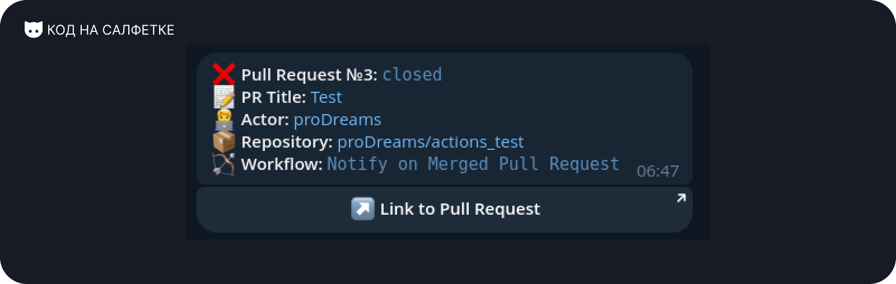
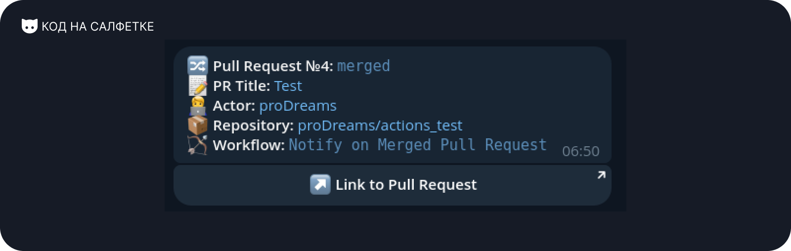

# Napkin Tools: Actions Telegram Notify


[](https://t.me/press_any_button)
[](https://t.me/writeanynotes)

An action for sending notifications to Telegram about the status of a Workflow execution in a GitHub/Gitea/GitHub
Actions-compatible CI/CD system.

Actions Telegram Notify helps track the status of running Workflows.

## [Русская версия](./README-RU.MD)

## Table of Contents

- [Features](#features)
- [Requirements](#requirements)
- [Execution Arguments](#execution-arguments)
    - [`status` Values](#status-values)
    - [`notify_fields` Values](#notify_fields-values)
- [Usage Example](#usage-example)
    - [`Push` Event](#push-event)
        - [Field Breakdown](#field-breakdown)
    - [`Pull Request` Event](#pull-request-event)
- [Notification Examples](#notification-examples)
    - [Notification for Successful Workflow Completion in a Push Event](#notification-for-successful-workflow-completion-in-a-push-event)
    - [Notification for Opening a Pull Request](#notification-for-opening-a-pull-request)
    - [Notification for Closing a Pull Request](#notification-for-closing-a-pull-request)
    - [Notification for Merging a Pull Request](#notification-for-merging-a-pull-request)
- [Author](#author)
- [Support](#support)
- [Contributors](#contributors)
- [License](#license)

## Features

- Sends status updates to Telegram (e.g., success, failure, canceled).
- Customizable notifications with a title, message, and footer.
- Includes additional fields such as commit author, repository, workflow name, and more.
- Supports Push and Pull Request events. (Need more? Open an Issue or submit a Pull Request!)
- Automatically generates a button with a link to the Commit or Pull Request in the notification.

## Requirements

To use Actions Telegram Notify, you need:

- **Telegram Bot Token** (can be created via [BotFather](https://t.me/BotFather)).
- **Telegram Chat ID**:
    - For direct messages from the bot: `1234567`.
    - For a small group: `-1234567`.
    - For a large group/supergroup: `-1001234567`.
    - **Important:**
        - For direct messages, you need to start a chat with the bot.
        - For groups, add the bot and grant it minimal admin rights to send messages.
- **(Optional) Telegram Chat Thread ID** – required for sending messages to a specific topic in a supergroup.

## Execution Arguments

| Name            | Required | Description                                                                                                                 |  
|-----------------|----------|-----------------------------------------------------------------------------------------------------------------------------|  
| `token`         | Yes      | Telegram Bot Token. Use GitHub Secrets for secure storage.                                                                  |  
| `chat_id`       | Yes      | Telegram Chat ID. Use GitHub Secrets for secure storage.                                                                    |  
| `thread_id`     | No       | Telegram Chat Thread ID.                                                                                                    |  
| `status`        | No       | Workflow status, retrieved from `${{ job.status }}` or set manually (e.g., `pending`). Defaults to `info` if not specified. |  
| `title`         | No       | Custom title text for the notification. Defaults to a general message.                                                      |  
| `message`       | No       | Custom message text to include in the notification.                                                                         |  
| `footer`        | No       | Text to append at the end of the notification.                                                                              |  
| `notify_fields` | No       | Comma-separated list of additional fields to include. See [`notify_fields` Values](#notify_fields-values) for details.      |

### `status` Values

Statuses apply to the `Push` event.

| Value       | Description                      |  
|-------------|----------------------------------|  
| `success`   | Workflow completed successfully. |  
| `failure`   | Workflow failed.                 |  
| `cancelled` | Workflow was canceled.           |  
| `pending`   | Workflow is in progress.         |  
| `info`      | Informational status.            |

### `notify_fields` Values

| Field           | Event                  | Description                                                |  
|-----------------|------------------------|------------------------------------------------------------|  
| `actor`         | `Push`, `Pull Request` | Username with a profile link who triggered the Workflow.   |  
| `repository`    | `Push`, `Pull Request` | Repository name with a link where the Workflow is running. |  
| `workflow`      | `Push`, `Pull Request` | Name of the running Workflow.                              |  
| `branch`        | `Push`                 | Branch where the Workflow was triggered.                   |  
| `commit`        | `Push`                 | First line of the commit message.                          |  
| `repo_with_tag` | `Push`                 | Repository name with a tag.                                |  

## Usage Example

### `Push` Event

```yaml
name: CI

on:
  push:

jobs:
  notify:
    runs-on: ubuntu-latest

    steps:
      - name: Run Actions Telegram Notify
        uses: proDreams/actions-telegram-notifier@main
        if: always()
        with:
          token: ${{ secrets.TELEGRAM_BOT_TOKEN }}
          chat_id: ${{ secrets.TELEGRAM_CHAT_ID }}
          status: ${{ job.status }}
          notify_fields: "actor,repository,workflow,branch,commit"
          message: "Test message."
          footer: "Test footer"
```

### Field Breakdown

- **`name`** - Specifies the step name (optional).
- **`uses`** - Specifies the Action to use. It is recommended to use the latest version from the `main` branch.
- **`if`** - Defines the execution condition:
    - `always()` - Always runs, regardless of Workflow status (recommended).
    - `cancelled()` - Runs only if the Workflow was canceled.
    - `failure()` - Runs only if the Workflow failed.
    - `success()` - Runs only if the Workflow was successful.
- **`with`** - List of input parameters required for execution. See [Execution Arguments](#execution-arguments) for
  details.

### `Pull Request` Event

```yaml
name: CI

on:
  pull_request:
    types:
      - closed
      - opened

jobs:
  notify:
    runs-on: ubuntu-latest

    steps:
      - name: Run Actions Telegram Notify
        uses: proDreams/actions-telegram-notifier@main
        if: always()
        with:
          token: ${{ secrets.TELEGRAM_BOT_TOKEN }}
          chat_id: ${{ secrets.TELEGRAM_CHAT_ID }}
          status: ${{ job.status }}
          notify_fields: "actor,repository,workflow"
```

## Notification Examples

### Notification for Successful Workflow Completion in a Push Event


### Notification for Opening a Pull Request


### Notification for Closing a Pull Request



### Notification for Merging a Pull Request



## Author

Author: Ivan Ashikhmin  
Telegram for contact: [https://t.me/proDreams](https://t.me/proDreams)

This Action was created as part of the "Code on a Napkin" project.

- Website: [https://pressanybutton.ru/](https://pressanybutton.ru/)
- Telegram Channel: [https://t.me/press_any_button](https://t.me/press_any_button)

## Support

If you like this project and want to support its further development, consider donating:

- Donation via TON: `UQBU8rJEfUcBvJUbz6NbXiWxaOO_NoXHK_pXOWv7qsOBWbFp`
- [Support on Boosty](https://boosty.to/prodream)
- [Donate via our Telegram bot with Telegram Stars](https://t.me/press_any_button_bot?start=donate)

Your support helps the project grow and improve future features!

## Contributors

<a href="https://github.com/proDreams/actions-telegram-notifier/graphs/contributors">
  
</a>  

## License

This project is distributed under the MIT License. See the [LICENSE](LICENSE) file for details.